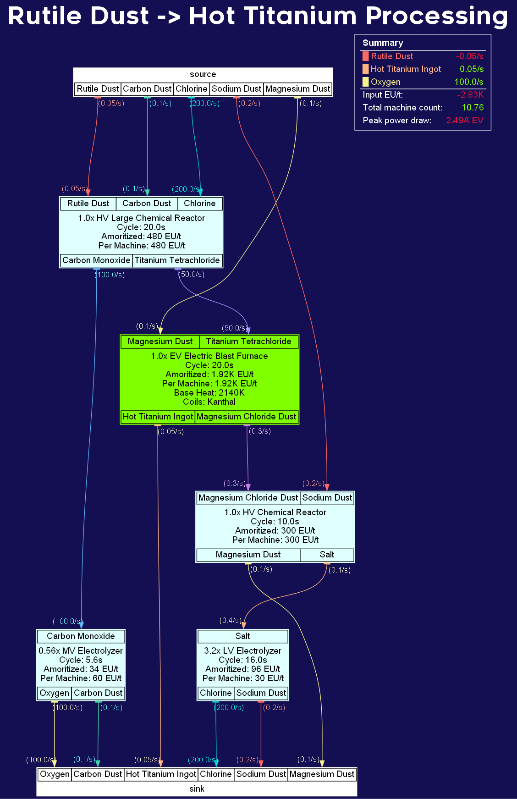
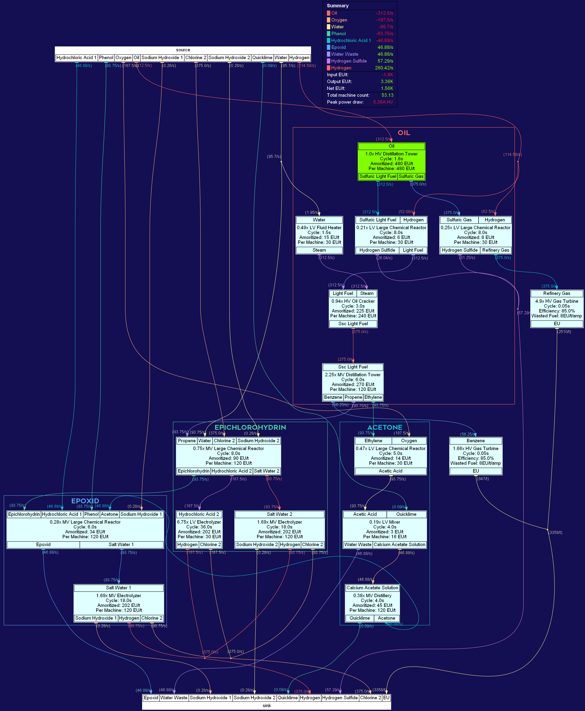

# gtnh-velo

## What is it?

This is my fork of OrderedSet86's [gtnh-flow](https://github.com/OrderedSet86/gtnh-flow).  
Visit the original github page of [gtnh-flow](https://github.com/OrderedSet86/gtnh-flow) to view the full description and install.

This repository only serves to be a place for the graphs I make using this tool with my own formatting.
## Samples

    
Click to reveal

     Titanium">
    

