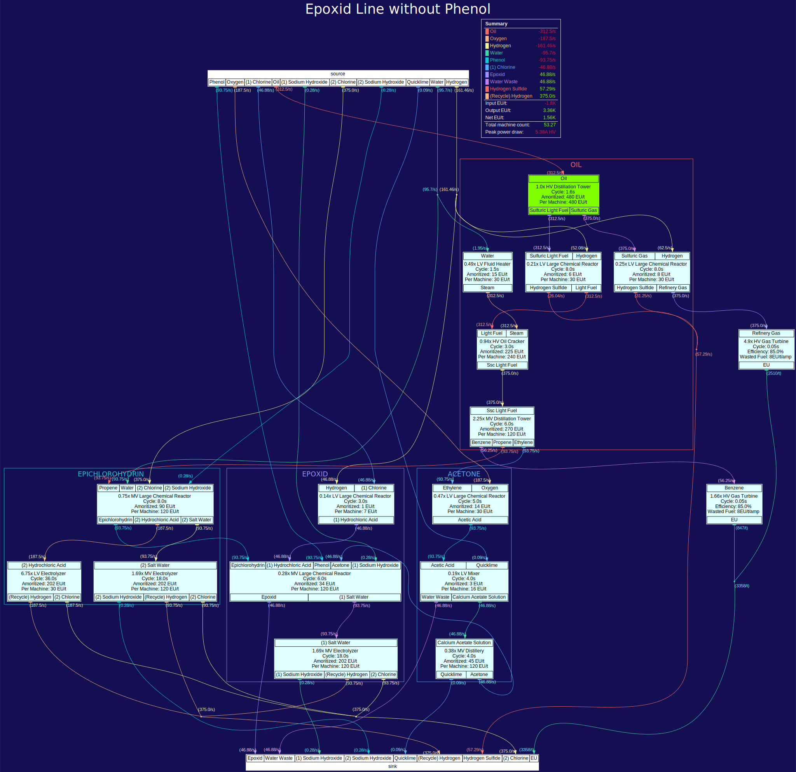

<h1>
    gtnh-velo
    
    <a href="https://codecov.io/github/velolib/gtnh-velo" >
        
    </a>
</h1>
<!-- TODO: Shorten the readme to move some of it into the wiki -->

## ❓ What is it?

This is a fork of OrderedSet86's [gtnh-flow](https://github.com/OrderedSet86/gtnh-flow). In addition to the functionalities of the original tool, this fork has:
1. Extended formatting of projects
2. Added stylization add formatting of graphs
3. Standards to increase readability
4. A custom CLI

## 📖 Samples
Samples of the graphs in the repository.
<details open>
    <summary><strong>Samples</strong></summary>
     Titanium">
    
</details>

## ⏲️ Installation
### Install as Python package
This is the easiest installation method. In the terminal run:
```
pip install gtnhvelo -U
```


### Linux
1. Clone this repository `git clone https://github.com/velolib/gtnh-velo.git`
2. Download Python 3 and install from `https://www.python.org/downloads/`
3. Navigate to the cloned repository and install the required project dependencies `pip install -r requirements.txt`
4. Install Graphviz, on Debian-based Linux it's `sudo apt-get install graphviz`
    - If Graphviz is not added to the system path, you can add the path to the `/bin` folder in the configuration file.

### Windows
1. Clone this repository `git clone https://github.com/velolib/gtnh-velo.git`
2. Download Python 3 and install from `https://www.python.org/downloads/`
3. Navigate to the cloned repository and install the required project dependencies `pip install -r requirements.txt`
4. Install Graphviz, for Windows there is a guide [here](https://forum.graphviz.org/t/new-simplified-installation-procedure-on-windows/224). Graphviz must be added to the system PATH for all users or the current user which may or may not need a system restart.
    - If Graphviz is not added to the system path, you can add the path to the `/bin` folder in the configuration file.

>It's recommended to create a virtual environment before installing to isolate the development environment from the global scope.


## ⏲️ Usage
### CLI
1. Create a project under `projects/`. You can look at existing projects to see the structure.
2. The project name is a system file path relative to `projects/`, for example `plastics/epoxid`. You can run the graph creator in 2 ways:
    - `flow [project name]`
    - `flow` then inputting your project name in the dialog
3. The output graph will pop up and be available in `output/`

When running `flow` the directories `projects/` and `output/` will be created in the working directory if they do not exist already.
### In code
You can use gtnh-velo in Python code like this:
```python
from gtnhvelo import flow
flow('project_name', 'output_path', 'projects_path')
```
Using gtnh-velo in Python also automatically turns on quiet mode.

## ⁉ Answers
### How to configure
The configuration file `flow_config.yaml` will be created on startup in the working directory if not created already.
You can configure a variety of layout and functional options using it. Make sure to not delete any keys.

### Automatic overclocking
All of the names in the following image are recognized and will be overclocked automatically to 1A of the tier you select. This includes the EBF, which will default to 1 hatch of the selected tier.
<details>
    <summary><strong>Recognized Overclocks</strong></summary>
    
</details>

### Dealing with multi-I/O
Sometimes the balancing algorithm will fail. You may need to manually make the adjustments by renaming the ingredients so that it will only be used for the recipes you want. An example: `chlorine 1`, `chlorine 2`
### Project Standards
This section will cover how to create a basic project.

#### Basic recipes
Here is how to write a recipe (note the indentation):
```yaml
- m: large chemical reactor
  tier: HV # The recipe tier, minimum LV
  I: # Inputs
    nonrecycle hydrochloric acid: 3000
    hydrochloric acid: 27000
    raw silicon dust: 10
  O: # Outputs
    trichlorosilane: 9000
    silicon tetrachloride: 300
    hexachlorodisilane: 200
    dichlorosilane: 300
    '[recycle] hydrogen': 20400 # Recycle this output
  eut: 480 # EU/t of recipe
  dur: 7.5 # Recipe duration in seconds
  group: silicon # Used to group recipes on the graph
```
In every project there needs to be 1 (and only 1) recipe that needs to be locked. This is the recipe that every other recipe will be balanced off of. Here are the fields you need to add:
```yaml
# These 2 fields (target and number) are mutually exclusive!
- m: example machine
  target: # lock it to the number of a specific ingredient output per second
    trichlorosilane: 4000
# -------------------------------------------------------------------
  number: 2 # lock the number of machines for this recipe
```
#### Advanced recipes
This section will cover the exceptions to the recipes.
Some fields you need to know about:
``` yaml
- m: example machine
  heat: 4001 # The required heat for a recipe
  coils: nichrome # The selected coils for a recipe
  saw_type: saw # The saw type for a Tree Growth Simulator
  material: shadow # Turbine material for turbines
  size: large # Turbine size for turbines
  pipe_casings: tungstensteel # Pipe casings for chemplants
```

<details>
    <summary><strong>Special Recipes</strong></summary>

```yaml
# Electric Blast Furnace example
- m: electric blast furance
tier: HV
I:
    tungstic acid: 7
O:
    tungsten trioxide: 4
eut: 480
dur: 10
heat: 1200
coils: nichrome
number: 1
```

```yaml
# Chemical Plant example
- m: chem plant
tier: LuV
I:
    pine wood: 0.1
O:
    crushed pine materials: 40
eut: 120
dur: 10
coils: tungstensteel
pipe_casings: tungstensteel

```

```yaml
# GT++ Machine example
- m: industrial sifter
tier: HV
I:
    platinum salt dust: 1
O:
    refined platinum salt dust: 0.95
eut: 30
dur: 30
group: pmp recycling

```

```yaml
# Multiblock turbine example
# in the finished graph it will calculate the actual numbers
- m: LGT
tier: EV
I:
    benzene: 1
O: {}
eut: 0
dur: 0
material: shadow
size: large
```

</details>


## 🙏 Thanks
Visit the original [gtnh-flow by OrderedSet](https://github.com/OrderedSet86/gtnh-flow). Without it this fork would not exist!

